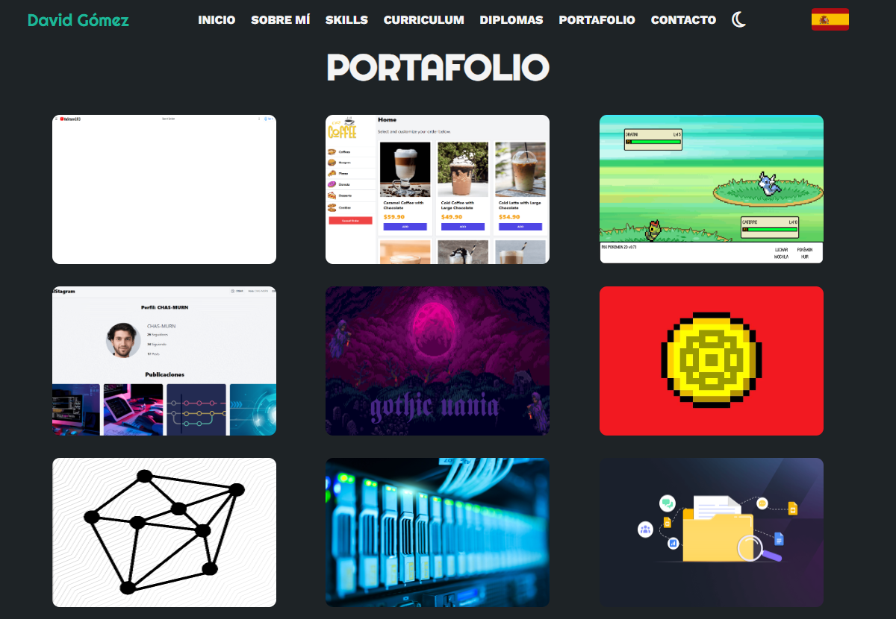

# _PORTFOLIO_

- **DESCRIPTION :**

  Welcome to my portfolio website! Here, you'll find a showcase of my projects, skills, and experiences as a web developer. From front-end designs to back-end functionalities, explore my work and discover how I bring ideas to life in the digital world. Explore my projects, delve into my journey, and feel free to reach out if you're interested in collaborating or have any questions. I'm excited to hear from you and see where my work can take me next!

---

- **STACK :**

  - **Portfolio** : `1.2.1`

---

- **URLS :**

  - **Web : [Portfolio](https://davidgomeztoca.github.io/portfolio)**

---

- **CREDITS :**

  - **Author : [David Gómez](https://github.com/DavidGomezToca)**
